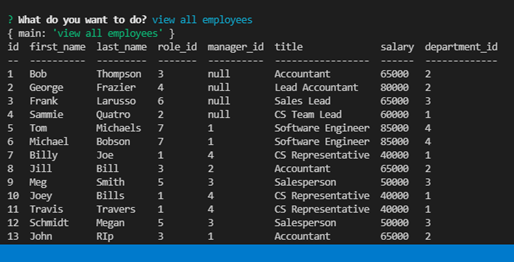

# Employee Tracker

  ## Table of Contents
  -[Description](#description)

  -[Installation](#installation)

  -[Demo](#demo)

  -[Usage](#usage)

  -[Contributors](#contributors) 

  -[Questions](#questions)

  ## Description
  Have access to a employee database where you can view, add, and update information for departments, positions, and employees.

  ## Installation
  You will need to install 3 packages:

  -inquirer

  -mysql

  -console.table

  ## Demo

   

  ## Usage
  After all packages have been installed. Enter your mysql password on the connection.js to create the connection.  Run 'node server.js' in the terminal to access the application.

  ## Contributors
  John Ripplinger 

  ## Questions
  https://github.com/johnrip89

  lebronjohn89@gmail.com